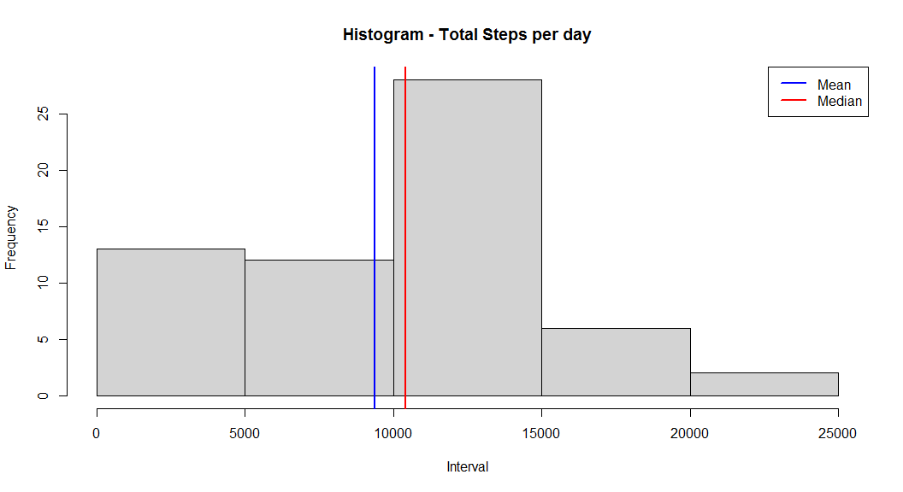
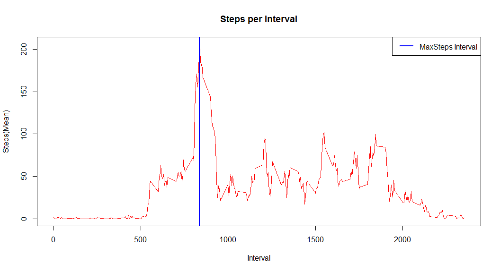
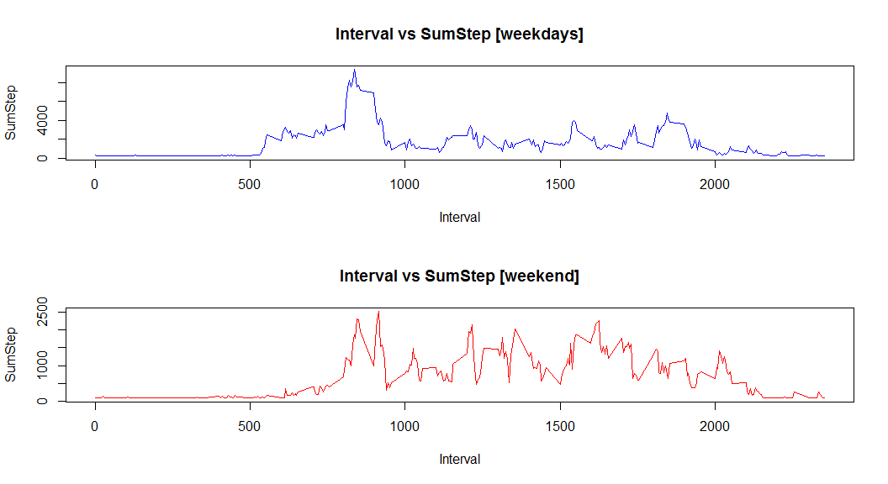

# PA1_template.Rmd
Sudeep Kumar Kushwaha  
September 18, 2017  

#Introduction

It is now possible to collect a large amount of data about personal movement using activity monitoring devices such as a [Fitbit](http://www.fitbit.com/), [Nike Fuelband](http://www.nike.com/us/en_us/c/nikeplus-fuelband), or [Jawbone Up](https://jawbone.com/up). These type of devices are part of the "quantified self" movement - a group of enthusiasts who take measurements about themselves regularly to improve their health, to find patterns in their behavior, or because they are tech geeks. But these data remain under-utilized both because the raw data are hard to obtain and there is a lack of statistical methods and software for processing and interpreting the data.

This assignment makes use of data from a personal activity monitoring device. This device collects data at 5 minute intervals through out the day. The data consists of two months of data from an anonymous individual collected during the months of October and November, 2012 and include the number of steps taken in 5 minute intervals each day.

# Points covered in the Assignment

1. Code for reading in the dataset and/or processing the data
2. Histogram of the total number of steps taken each day
3. Mean and median number of steps taken each day
4. Time series plot of the average number of steps taken
5. The 5-minute interval that, on average, contains the maximum number of steps
6. Code to describe and show a strategy for imputing missing data
7. Histogram of the total number of steps taken each day after missing values are imputed
8. Panel plot comparing the average number of steps taken per 5-minute interval across weekdays and weekends
9. All of the R code needed to reproduce the results (numbers, plots, etc.) in the report

## Code for reading in the dataset and/or processing the data

```r
d<- read.csv (file = "activity.csv", header = TRUE)
d$date<-as.Date(d$date,format='%Y-%m-%d')
```

## Histogram of the total number of steps taken each day


```r
d1 <- aggregate(x = d[c("steps","interval")],
                     FUN = sum,
                     by = list(Group.date = d$date), na.rm=TRUE)

##  Histogram
hist(d1$steps,
     col = "lightgray",
     border = "black", 
     xlab = "Interval",
     main = "Histogram - Total Steps per day")
  abline(v = mean(d1$steps),
         col = "blue",
         lwd = 2)
  abline(v = median(d1$steps),
         col = "red",
         lwd = 2)
  legend(x = "topright", 
       c("Mean", "Median"),
       col = c("blue", "red"),
       lwd = c(2, 2, 2))
```

<!-- -->

## Mean and median number of steps taken each day


```r
d1mean <- setNames(aggregate(x = d[c("steps")],
                FUN = mean,
                by = list(d$date), na.rm=TRUE), c("Date", "Mean"))

d1median <- setNames(aggregate(x = d[c("steps")],
                    FUN = median,
                    by = list(d$date), na.rm=TRUE), c("Date", "Median"))

d1stats <- merge(d1mean,d1median,by="Date")

print(d1stats)
```

```
##          Date       Mean Median
## 1  2012-10-01        NaN     NA
## 2  2012-10-02  0.4375000      0
## 3  2012-10-03 39.4166667      0
## 4  2012-10-04 42.0694444      0
## 5  2012-10-05 46.1597222      0
## 6  2012-10-06 53.5416667      0
## 7  2012-10-07 38.2465278      0
## 8  2012-10-08        NaN     NA
## 9  2012-10-09 44.4826389      0
## 10 2012-10-10 34.3750000      0
## 11 2012-10-11 35.7777778      0
## 12 2012-10-12 60.3541667      0
## 13 2012-10-13 43.1458333      0
## 14 2012-10-14 52.4236111      0
## 15 2012-10-15 35.2048611      0
## 16 2012-10-16 52.3750000      0
## 17 2012-10-17 46.7083333      0
## 18 2012-10-18 34.9166667      0
## 19 2012-10-19 41.0729167      0
## 20 2012-10-20 36.0937500      0
## 21 2012-10-21 30.6284722      0
## 22 2012-10-22 46.7361111      0
## 23 2012-10-23 30.9652778      0
## 24 2012-10-24 29.0104167      0
## 25 2012-10-25  8.6527778      0
## 26 2012-10-26 23.5347222      0
## 27 2012-10-27 35.1354167      0
## 28 2012-10-28 39.7847222      0
## 29 2012-10-29 17.4236111      0
## 30 2012-10-30 34.0937500      0
## 31 2012-10-31 53.5208333      0
## 32 2012-11-01        NaN     NA
## 33 2012-11-02 36.8055556      0
## 34 2012-11-03 36.7048611      0
## 35 2012-11-04        NaN     NA
## 36 2012-11-05 36.2465278      0
## 37 2012-11-06 28.9375000      0
## 38 2012-11-07 44.7326389      0
## 39 2012-11-08 11.1770833      0
## 40 2012-11-09        NaN     NA
## 41 2012-11-10        NaN     NA
## 42 2012-11-11 43.7777778      0
## 43 2012-11-12 37.3784722      0
## 44 2012-11-13 25.4722222      0
## 45 2012-11-14        NaN     NA
## 46 2012-11-15  0.1423611      0
## 47 2012-11-16 18.8923611      0
## 48 2012-11-17 49.7881944      0
## 49 2012-11-18 52.4652778      0
## 50 2012-11-19 30.6979167      0
## 51 2012-11-20 15.5277778      0
## 52 2012-11-21 44.3993056      0
## 53 2012-11-22 70.9270833      0
## 54 2012-11-23 73.5902778      0
## 55 2012-11-24 50.2708333      0
## 56 2012-11-25 41.0902778      0
## 57 2012-11-26 38.7569444      0
## 58 2012-11-27 47.3819444      0
## 59 2012-11-28 35.3576389      0
## 60 2012-11-29 24.4687500      0
## 61 2012-11-30        NaN     NA
```

## Time series plot of the average number of steps taken


```r
## aggregated table for graphic
d2mean <- setNames(aggregate(x = d[c("steps")],
                             FUN = mean,
                             by = list(d$interval), na.rm=TRUE), c("Interval", "MeanStep"))

## Interval with Max Average Steps
d2max<-subset(d2mean, d2mean$MeanStep==max(d2mean$MeanStep, na.rm = TRUE))

## plot histogram
plot(d2mean$Interval, d2mean$MeanStep, type="l", main = "Steps per Interval", xlab= "Interval", ylab= "Steps(Mean)", col="red" ,lwd=1)
    abline(v = d2max$Interval, col = "blue", lwd = 2)
    legend(x = "topright", 
           c("MaxSteps Interval"),
           col = c("blue"),
           lwd = c(2, 2, 2))
```

<!-- -->

## The 5-minute interval that, on average, contains the maximum number of steps


```r
d2max<-subset(d2mean, d2mean$MeanStep==max(d2mean$MeanStep, na.rm = TRUE))
    print(d2max)
```

```
##     Interval MeanStep
## 104      835 206.1698
```

## Code to describe and show a strategy for imputing missing data


```r
## original data to be stored in a new variable called 'd3'
d3 <- d

##NA values in column 'Steps' are replaced with global average
d3$steps[which(is.na(d3$steps))] <- mean(d3$steps, na.rm = TRUE)

## example
head(d3)
```

```
##     steps       date interval
## 1 37.3826 2012-10-01        0
## 2 37.3826 2012-10-01        5
## 3 37.3826 2012-10-01       10
## 4 37.3826 2012-10-01       15
## 5 37.3826 2012-10-01       20
## 6 37.3826 2012-10-01       25
```

## Histogram of the total number of steps taken each day after missing values are imputed


```r
## aggregated data for histogram
d4 <- aggregate(x = d3[c("steps")],
                FUN = sum,
                by = list(Group.date = d$date), na.rm=TRUE)

## stats
d4mean <- setNames(aggregate(x = d4[c("steps")],
                             FUN = mean,
                             by = list( d4$Group.date), na.rm=TRUE), c("Date", "Mean"))

d4median <- setNames(aggregate(x = d4[c("steps")],
                               FUN = median,
                               by = list(d4$Group.date), na.rm=TRUE), c("Date", "Median"))

d4stats <- merge(d4mean,d4median,by="Date")

print(d4stats)
```

```
##          Date     Mean   Median
## 1  2012-10-01 10766.19 10766.19
## 2  2012-10-02   126.00   126.00
## 3  2012-10-03 11352.00 11352.00
## 4  2012-10-04 12116.00 12116.00
## 5  2012-10-05 13294.00 13294.00
## 6  2012-10-06 15420.00 15420.00
## 7  2012-10-07 11015.00 11015.00
## 8  2012-10-08 10766.19 10766.19
## 9  2012-10-09 12811.00 12811.00
## 10 2012-10-10  9900.00  9900.00
## 11 2012-10-11 10304.00 10304.00
## 12 2012-10-12 17382.00 17382.00
## 13 2012-10-13 12426.00 12426.00
## 14 2012-10-14 15098.00 15098.00
## 15 2012-10-15 10139.00 10139.00
## 16 2012-10-16 15084.00 15084.00
## 17 2012-10-17 13452.00 13452.00
## 18 2012-10-18 10056.00 10056.00
## 19 2012-10-19 11829.00 11829.00
## 20 2012-10-20 10395.00 10395.00
## 21 2012-10-21  8821.00  8821.00
## 22 2012-10-22 13460.00 13460.00
## 23 2012-10-23  8918.00  8918.00
## 24 2012-10-24  8355.00  8355.00
## 25 2012-10-25  2492.00  2492.00
## 26 2012-10-26  6778.00  6778.00
## 27 2012-10-27 10119.00 10119.00
## 28 2012-10-28 11458.00 11458.00
## 29 2012-10-29  5018.00  5018.00
## 30 2012-10-30  9819.00  9819.00
## 31 2012-10-31 15414.00 15414.00
## 32 2012-11-01 10766.19 10766.19
## 33 2012-11-02 10600.00 10600.00
## 34 2012-11-03 10571.00 10571.00
## 35 2012-11-04 10766.19 10766.19
## 36 2012-11-05 10439.00 10439.00
## 37 2012-11-06  8334.00  8334.00
## 38 2012-11-07 12883.00 12883.00
## 39 2012-11-08  3219.00  3219.00
## 40 2012-11-09 10766.19 10766.19
## 41 2012-11-10 10766.19 10766.19
## 42 2012-11-11 12608.00 12608.00
## 43 2012-11-12 10765.00 10765.00
## 44 2012-11-13  7336.00  7336.00
## 45 2012-11-14 10766.19 10766.19
## 46 2012-11-15    41.00    41.00
## 47 2012-11-16  5441.00  5441.00
## 48 2012-11-17 14339.00 14339.00
## 49 2012-11-18 15110.00 15110.00
## 50 2012-11-19  8841.00  8841.00
## 51 2012-11-20  4472.00  4472.00
## 52 2012-11-21 12787.00 12787.00
## 53 2012-11-22 20427.00 20427.00
## 54 2012-11-23 21194.00 21194.00
## 55 2012-11-24 14478.00 14478.00
## 56 2012-11-25 11834.00 11834.00
## 57 2012-11-26 11162.00 11162.00
## 58 2012-11-27 13646.00 13646.00
## 59 2012-11-28 10183.00 10183.00
## 60 2012-11-29  7047.00  7047.00
## 61 2012-11-30 10766.19 10766.19
```

## Panel plot comparing the average number of steps taken per 5-minute interval across weekdays and weekends


```r
d5<-d3
d5$day <- weekdays(d3$date)
d5$day <- ifelse(d5$day == "Saturday" | d5$day == "Sunday" ,"weekend", "weekday")
d5$day <- as.factor(d5$day)


## aggregated data for graphic
d5sum <- setNames(aggregate(x = d5[c("steps")],
                             FUN = sum,
                             by = list(d5$interval, d5$day), na.rm=TRUE), c("Interval", "day", "SumStep"))

## subsetting data for graphics
d5weekday<-subset(d5sum, d5sum$day=="weekday")
d5weekend<-subset(d5sum, d5sum$day=="weekend")

## plot
  par(mfrow=c(2,1))
        plot(d5weekday$Interval,d5weekday$SumStep, main="Interval vs SumStep [weekdays]", type = "l", col = "blue", xlab = "Interval", ylab = "SumStep")
        plot(d5weekend$Interval,d5weekend$SumStep, main="Interval vs SumStep [weekend]", type = "l", col = "red", xlab = "Interval", ylab = "SumStep")
```

<!-- -->

## All of the R code needed to reproduce the results (numbers, plots, etc.) in the report

Steps 1-8
